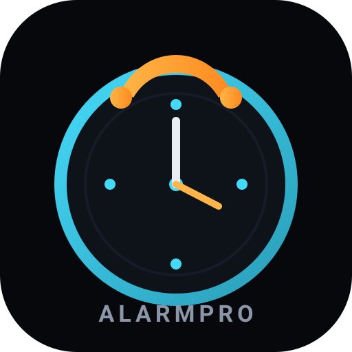

<p align="center">
  
</p>

<h1 align="center">Alarmpro</h1>

<p align="center">
  Open-source Android alarm clock app · <code>ca.sekhrit.alarmpro</code>
</p>

<p align="center">
  <a href="https://github.com/Tariq-Sekhri/Alarmpro/actions/workflows/android-build.yml">
    
  </a>
  <a href="LICENSE">
    
  </a>
</p>

Alarmpro is an open-source Android alarm clock app built with Kotlin and Jetpack Compose. It includes alarms, timers, a stopwatch, and a world clock, with grouping, bulk actions, and a full-screen ringing UI.

## Features

### Alarms
- Create and edit alarms with an analog time picker
- Repeating schedules and skip-next-occurrence
- Next-alarm header with countdown
- Search and sort (next trigger or time of day)
- Long-press selection mode: delete, enable/disable, skip next, or group alarms
- Alarm groups: collapse, rename, enable/disable, skip, and ungroup
- Per-alarm snooze, vibration, and read-label-aloud settings

### Ringing screen
- Full-screen dark UI with large time display
- Snooze and dismiss actions
- Works over the lock screen

### Timer
- Preset timers with add/edit support
- Timer finished notification and full-screen alert

### Stopwatch
- Start, pause, reset, and lap tracking

### Clock
- Multiple time zones

### Settings
- Default alarm behavior (snooze, vibration, speak label)
- Timer and general app settings

## Requirements

- Android 8.0 (API 26) or higher
- Android Studio Ladybug or newer recommended
- JDK 11+

## Package

`ca.sekhrit.alarmpro`

## Build

Clone the repository and run:

```bash
./gradlew :app:assembleDebug
```

Install on a connected device or emulator:

```bash
./gradlew :app:installDebug
```

On Windows:

```bat
gradlew.bat :app:installDebug
```

CI builds run on every push to `main` via GitHub Actions. Download APK artifacts from the [Actions](https://github.com/Tariq-Sekhri/Alarmpro/actions) tab after a successful build.

## Tech stack

- Kotlin
- Jetpack Compose + Material 3
- ViewModel + StateFlow
- AlarmManager for exact alarms
- SharedPreferences for local storage

## Project structure

```
app/src/main/java/ca/sekhrit/alarmpro/
├── ui/           # Compose screens and theme
├── viewmodel/    # Alarm, timer, stopwatch state
├── data/         # Models and repositories
├── domain/       # Alarm actions (dismiss, snooze)
├── receiver/     # Alarm scheduling, boot receiver, notifications
└── util/         # Time formatting, repeat logic, grouping
```

## Permissions

The app requests permissions needed for reliable alarms:

- `SCHEDULE_EXACT_ALARM` / `USE_EXACT_ALARM` — fire alarms on time
- `POST_NOTIFICATIONS` — alarm and timer notifications
- `WAKE_LOCK` — wake device when ringing
- `RECEIVE_BOOT_COMPLETED` — reschedule alarms after reboot
- `USE_FULL_SCREEN_INTENT` — full-screen alarm UI
- `VIBRATE` — vibration during alarms

## Contributing

Contributions are welcome. Feel free to open an issue or submit a pull request.

1. Fork the repository
2. Create a feature branch
3. Make your changes
4. Open a pull request with a clear description

## License

This project is licensed under the MIT License. See [LICENSE](LICENSE) for details.

## Author

[Tariq-Sekhri](https://github.com/Tariq-Sekhri)
